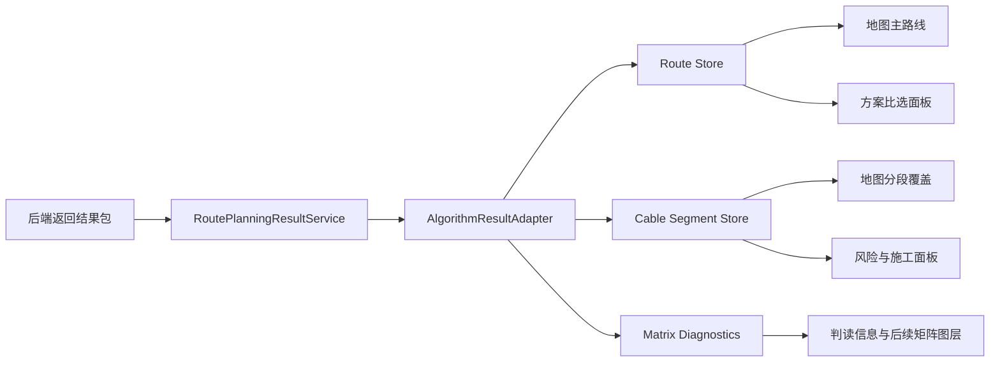

# 路由规划结果包驱动设计

## 背景

后端后续返回的路由规划结果与当前 `route_planning_results` 包结构一致。前端需要按照《核心算法模块 API 说明文档》的语义解释这些数据，而不是把结果文件当作临时演示数据。

文档中路由规划部分明确了三个层次：

- 成本与风险模型输出 `cost.txt`、`risk.txt`，表示目标海域成本矩阵和风险矩阵。
- FMM 路由规划模型输出 `FMM_path_result.json`，表示 FMM 路由集合。
- 路由集合中的 `real_trace` 是真实经纬度路径，`trace` 是栅格索引路径，`total_cost` 和 `total_risk` 是该路径的累计总成本和累计总风险。

当前结果包额外包含两份分段结果：

- `segment_result_base_FixSpacing.json`：固定间距分段。
- `segment_result_base_Risk.json`：风险分段。

这两份分段结果应作为 FMM 主路线上的海缆分段叠加数据，而不是替代 FMM 主路线。

## 目标

1. 用后端结果包作为路由规划页面的权威数据源。
2. 用统一适配层把原始结果包转换为前端稳定模型。
3. 地图主路线、方案比选、风险分段、铠装建议、成本风险摘要都从同一套标准模型读取。
4. 明确区分“算法总成本”和“前端按铠装单价估算的分段成本”。
5. 对重复路线、缺失文件、矩阵格式异常、分段与路线不匹配等情况给出可见诊断。

## 非目标

- 不重新定义后端算法文件结构。
- 不在前端重新计算 FMM 路线。
- 不把铠装估算成本反写为算法总成本。
- 不要求第一期完成成本矩阵和风险矩阵的完整热力图渲染，但数据模型要为后续图层展示预留入口。

## 输入文件语义

### `FMM_path_result.json`

主路线数据源。每个元素表示一个候选路线方案。

前端使用字段：

- `real_trace`：画地图主路线。点结构按当前样例解释为 `[index, lon, lat]`。
- `trace`：矩阵采样时使用的栅格路径。点结构按当前样例解释为 `[index, row, col]`。
- `length`：路由长度，单位 km。存在时优先使用。
- `total_cost`：算法累计总成本。
- `total_risk`：算法累计总风险。

显示规则：

- FMM 是主路线的唯一来源。
- 如果多个 FMM 方案的 `real_trace` 完全一致，前端去重显示，但保留原始数量和去重数量诊断。
- 路线名称按去重后的顺序显示为 `FMM 路由方案 1`、`FMM 路由方案 2`。

### `segment_result_base_Risk.json`

默认海缆分段数据源。它描述某条 FMM 路线上的风险分段。

前端使用字段：

- `route_index`：关联原始 FMM 方案下标。
- `segments[].length_km`：分段长度。
- `segments[].cable_type`：算法分段给出的缆型代码，存在时保留。
- `risk_level[].risk_min`、`risk_level[].risk_max`：该段风险范围。

显示规则：

- 默认用它驱动地图上的彩色分段覆盖线。
- 高、中、低风险长度从它聚合。
- 它不用于画主路线，只按 KP 距离切割 FMM `real_trace` 后叠加。

风险等级口径：

- `risk_max > 100000`：高风险。
- `risk_max > 10000` 且 `risk_max <= 100000`：中风险。
- 其他：低风险。

### `segment_result_base_FixSpacing.json`

固定间距分段数据源。

显示规则：

- 保留为分段方案变体。
- 第一期默认展示风险分段，后续可在界面增加“风险分段 / 固定间距分段”切换。
- 如果风险分段缺失，可以回退到固定间距分段。

### `cost.txt`

成本矩阵。

使用规则：

- 解析为二维数值矩阵。
- 用于显示矩阵行列、最小值、最大值、均值等诊断信息。
- 可沿 FMM `trace` 采样，得到路线经过区域的成本样本摘要。
- 后续可作为成本栅格图层渲染数据源。

### `risk.txt`

风险矩阵。

使用规则：

- 解析为二维数值矩阵。
- 用于显示矩阵行列、最小值、最大值、均值等诊断信息。
- 可沿 FMM `trace` 采样，得到路线经过区域的风险样本摘要。
- 当分段结果缺少风险信息时，可作为 FMM 几何小段风险等级的回退来源。
- 后续可作为风险栅格图层渲染数据源。

## 标准前端模型

结果包进入前端后统一转换为 `AlgorithmResult`。

```ts
interface AlgorithmResult {
  routes: Route[]
  segmentsByRouteId: Record<string, CableSegment[]>
  segmentVariantsByRouteId: Record<string, {
    riskBased?: CableSegment[]
    fixedSpacing?: CableSegment[]
  }>
  matrices: {
    cost?: number[][]
    risk?: number[][]
  }
  diagnostics: AlgorithmDiagnostics
}
```

`Route` 保持项目现有结构，但需要明确以下字段来源：

- `rawTrunkCoordinates`：FMM `real_trace` 转换后的 `[lon, lat][]`。
- `totalLength` / `distance`：优先来自 FMM `length`。
- `totalCost` / `cost.total`：优先来自 FMM `total_cost`。
- `fmmPathMeta.totalRisk`：来自 FMM `total_risk`。
- `rawMatrixSamples`：沿 FMM `trace` 对 `cost.txt`、`risk.txt` 采样得到。

`CableSegment` 保持项目现有结构，但需要明确以下字段来源：

- `startKp`、`endKp`：由分段长度累计得到。
- `length`：来自 `segments[].length_km`。
- `riskLevel`：由 `risk_level[].risk_max` 分档得到。
- `cableTypeId`、`cableTypeName`：优先保留 `segments[].cable_type`，显示侧可再根据项目铠装映射补充友好名称。
- `armorType`：根据风险等级映射为双铠、单铠、轻型。

## 数据流



### `RoutePlanningResultService`

职责：

- 接收后端响应。
- 支持后端直接返回文件内容对象，也支持上传 zip 或本地样例。
- 按文件名或字段名识别 FMM、分段、成本矩阵、风险矩阵。
- 只负责读取和归类，不做业务解释。

### `AlgorithmResultAdapter`

职责：

- 解析矩阵。
- FMM 路线去重。
- 转换 `Route[]`。
- 关联分段文件到 FMM 路线。
- 生成默认分段和分段变体。
- 生成诊断信息。

### Store 和组件

职责：

- `routeStore` 保存标准路线。
- `cableSegmentStore` 保存当前路线的当前分段方案。
- 地图组件只读标准路线和标准分段。
- 面板组件只读标准摘要，不直接解析原始文件。

## 显示设计

### 地图

- 主路线：使用 FMM `real_trace` 画完整路线。
- 分段覆盖：使用当前分段方案按 KP 切割主路线后叠加颜色。
- 高风险显示红色，中风险显示黄色，低风险显示绿色。
- 点击分段时展示 KP 范围、长度、风险等级、缆型、来源文件。

### 方案比选

每条 FMM 路线显示：

- 方案名。
- FMM 长度。
- 算法总成本。
- 算法总风险。
- 高风险长度。
- 原始 FMM 下标。
- 如果该路线由重复路线合并而来，显示合并提示。

### 风险与施工面板

显示三组数据：

- 高风险、中风险、低风险长度和占比。
- 每个风险等级对应的铠装类型和单价。
- 分段缆型估算成本。

同时显示算法总成本，标题必须标明来自 FMM，避免与铠装估算混淆。

### 判读信息

显示：

- 已读取文件列表。
- FMM 原始数量、去重数量、重复数量。
- cost 矩阵行列、最小值、最大值、均值。
- risk 矩阵行列、最小值、最大值、均值。
- 分段文件关联到哪条 FMM 路线。
- 缺失文件或回退策略。

## 计算口径

### 路由长度

优先级：

1. FMM `length`。
2. FMM `real_trace` 按球面距离计算。
3. 分段长度求和。

### 算法总成本

优先级：

1. FMM `total_cost`。
2. 若 FMM 缺失，则显示为空或不可用。

不使用风险分段单价估算值替代算法总成本。

### 算法总风险

优先级：

1. FMM `total_risk`。
2. 若 FMM 缺失，则显示为空或不可用。

### 分段风险长度

来源：

1. 当前路线的 `segment_result_base_Risk.json` 分段。
2. 如果风险分段缺失，使用固定间距分段和风险矩阵采样回退。
3. 如果两者都缺失，使用 FMM 小段风险矩阵采样回退。

### 铠装映射

默认口径：

- 高风险：双铠装，默认 `DA-01 (双铠装)`。
- 中风险：单铠装，默认 `SA-01 (单铠装)`。
- 低风险：轻型，默认 `LW-01 (轻型)`。

实际显示优先使用项目设置中的 `armorMappings`。

### 分段缆型估算成本

计算公式：

```text
分段缆型估算成本 = Σ(风险等级长度 km × 对应单价 千元/km)
```

该值只用于施工和缆型估算，不代表 FMM 算法总成本。

## 异常与回退

- 缺少 `FMM_path_result.json`：不能生成主路线，提示后端结果缺少 FMM 路径。
- FMM 无 `real_trace`：尝试用 `trace` 生成诊断路线，但标注为非真实经纬度，不作为正式路线。
- 分段 `route_index` 找不到对应 FMM：挂到第一条可见 FMM 路线，并显示诊断。
- FMM 重复：去重展示，保留原始记录映射。
- 矩阵解析失败：不影响路线展示，但显示矩阵不可用。
- 分段总长度与 FMM `length` 差异超过 1%：仍展示，但给出黄色诊断。
- 分段 KP 超出 FMM 长度：截断到路线末端，并给出诊断。

## 验证策略

单元级验证：

- 结果包读取能识别五类文件。
- FMM 去重能把当前样例中的 3 条识别为 2 条可见路线。
- `real_trace` 能转换为 `[lon, lat][]`。
- 风险分段能聚合出高、中、低风险长度。
- 算法总成本来自 FMM `total_cost`。
- 铠装估算成本与算法总成本分别计算、分别展示。
- 矩阵解析能得到行列、最小值、最大值、均值。

界面级验证：

- 地图主路线与 FMM `real_trace` 一致。
- 风险分段覆盖在线路上，而不是另画折线替代主路线。
- 方案比选中重复路线不重复显示。
- 切换路线时分段与当前路线匹配。
- 缺失某个文件时界面给出清晰提示。

当前样例预期：

- FMM 原始路线 3 条。
- 可见去重路线 2 条。
- 第 1 条和第 2 条原始 FMM 记录重复。
- 风险分段关联 `route_index = 0`，默认挂到第一条可见路线。
- 风险分段总长约 `56.1039 km`。
- 高风险长度约 `9.8589 km`。
- 中风险长度 `0 km`。
- 低风险长度约 `46.245 km`。

## 实施顺序

1. 固化结果包类型和适配层边界。
2. 调整 FMM 主路线转换，确保主路线只来自 `real_trace`。
3. 调整分段关联和 KP 切割逻辑，默认使用风险分段。
4. 调整方案比选和风险面板，区分算法总成本与铠装估算成本。
5. 补充诊断信息和缺失文件提示。
6. 增加针对当前结果包的转换验证脚本或测试。
7. 运行构建，检查地图和面板展示。

## 通过标准

- 用户点击“开始规划”或加载后端结果后，地图展示 FMM 路线。
- 当前结果包显示 2 条不同路线，而不是 3 条重复路线。
- 第一条路线展示风险分段，高风险长度约 `9.8589 km`。
- 方案总成本显示 FMM `total_cost`。
- 风险面板的铠装估算成本单独展示，不覆盖算法总成本。
- 判读信息能说明读取了哪些文件、哪些路线重复、分段关联到了哪条路线。
